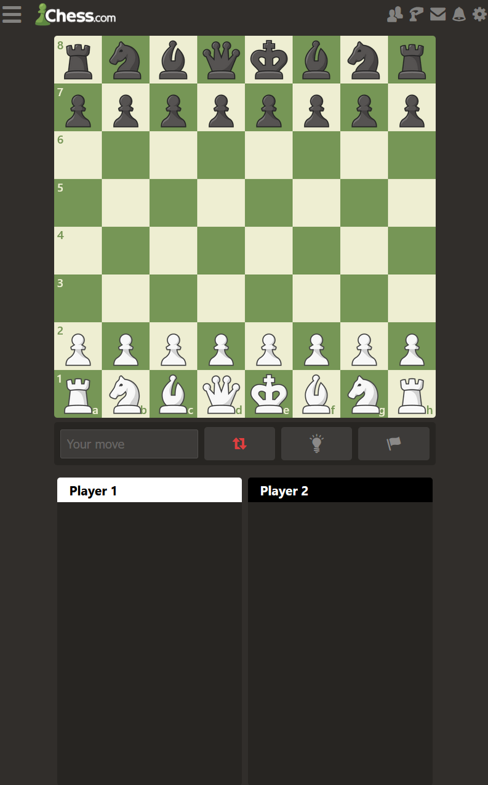
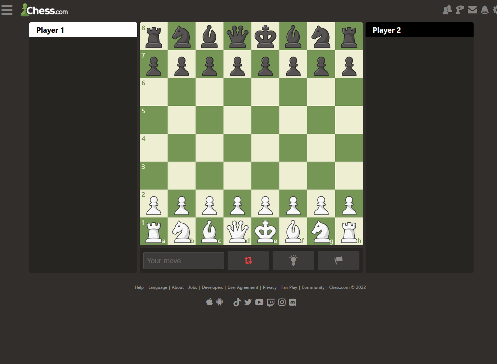

# Procesverslag

Markdown is een simpele manier om HTML te schrijven.  
Markdown cheat cheet: [Hulp bij het schrijven van Markdown](https://github.com/adam-p/markdown-here/wiki/Markdown-Cheatsheet).

Nb. De standaardstructuur en de spartaanse opmaak van de README.md zijn helemaal prima. Het gaat om de inhoud van je procesverslag. Besteedt de tijd voor pracht en praal aan je website.

Nb. Door _open_ toe te voegen aan een _details_ element kun je deze standaard open zetten. Fijn om dat steeds voor de relevante stuk(ken) te doen.

## Jij

  
uitwerken voor kick-off werkgroep

### Auteur:

Tim van Ingen

#### Je startniveau:

Zwart

#### Je focus:

Surface plane

## Je website

  
uitwerken voor kick-off werkgroep

### Je opdracht:

[chesscom](https://www.chess.com/home)

#### Screenshot(s) van de eerste pagina (small screen):

Home  
 

#### Screenshot(s) van de tweede pagina (small screen):

hier de naam van de pagina  
 

## Toegankelijkheidstest 1/2 (week 1)

  
uitwerken na test in 1e werkgroep

### Bevindingen

DIABETIS EN WAZIG

Grijze tekst is niet te lezen.
Hover is duidelijk.
Daily games titels niet te lezen.
Game informatie (friend & vs 0/0/0) niet te lezen.
Tekst bij popup is vaag.
Hover kan duidelijker.
Chessbord verschil is niet duidelijk loper en pion & wit tegel en pion.
Parkinsons is goed te navigeren.

KLEURENBLIND

Wel duidelijk grijswaardes.
Duidelijkere play knop.
(gewoon duidelijk)
Hover kan duidelijker als hij oplicht (hij wordt nu donkerder).
Hover over pion.

TOETSENBORD

Pionnen zijn niet goed te bewegen met toetsenbord.
De rest van de wereld.
Muis werkt ideaal.
Knoppen kunnen misschien iets beter (groter).

SCREENREADER

je kan niet het spel spelen.
Geen 'naar main content' knop.
Headings zijn een beetje raar.

#### Screenreader

Er was geen 'main content' knop. Het navigeren van headings werkte ook niet altijd en deze was niet echt goed werkend voor de hele pagina. Hij ging bijvoorbeeld alleen door de artikelen heen i.p.v. de hele pagina.

Main content knop toevoegen is vrij makkelijk. Verder moet er beter gebruik gemaakt worden van verschillende heading elementen.

#### Muis en Toetsenbord & Motoriek (shocks, elastiekjes)

De knoppen waren soms een beetje klein om consistent op te kunnen klikken. Verder was de site prima te navigeren. Op de gamepagina waren de pionnen niet echt te bewegen zonder muis, maar dat is buiten de scope van dit project.

Dit zou opgelost kunnen worden door de knoppen groter te maken of om padding toe te voegen.

#### Visueel (brillen, contrast, kleurenblind, dark/light).

Er zijn een aantal titels en teksten die niet goed te lezen zijn omdat de grijswaardes onvoldoende contrast hebben (grotendeels als het gaat om mensen met een visuele beperking). Verder is de pion over een wit scherm niet heel goed te zien. Tot slot kan de hover iets duidelijker zijn.

De tekst zou verbeterd kunnen worden door een andere kleur toe te voegen of door het contrast te verhogen met witte(re) tekst.
Verder zou er een hoog contrast optie kunnen komen bij het schaakbord die er voor zou zorgen dat het verschil tussen de pion en achtergrond duidelijker wordt. Denk aan andere kleuren of een dikkere outline.

Er staat play als tekst, wat sommige mensen op zouden kunnen vatten als 'de' play knop. Verder is het niet extreem duidelijk wanneer de knoppen gehovert worden.

Play veranderen naar trofeeen of een soortgelijk woord. Ook kan de hover misschien inverted worden (wat zwart is wit maken en andersom ook)

## Breakdownschets (week 1)

  
uitwerken na afloop 2e werkgroep

### de hele pagina:

  

## Voortgang 1 (week 2)

  
uitwerken voor 1e voortgang

### Stand van zaken

0 problemen.

### Agenda voor meeting

samen met je groepje opstellen

Julia

1. Hoe kan ik gebruikers door een carousel laten slippen d.m.v. Buttons (of in iedergeval met behulp van een klikbaar element)?
2. Hoe kan ik m’n hamburger menu full-screen tonen? (Via JS een class toevoegen of anders?)
3. Met 3 css style sheets; kan ik de variabele kleuren in 1 sheet zetten en die dan in de andere twee sheets gebruiken?

Tim

4. Hoe kan ik een functioneel schaakbord maken.
5. Hoe zorg ik ervoor dat mijn elements. Responsive blijven.
6. Hoe geef ik de gebruiker een lightmode optie.

Kim

1. Ik wilde sowieso weten hoe de animatie bij een hamburger menu werkt.
2. Hoe je een hamburger menu codeert.

### Verslag van meeting

- Alles is uitgelegd. Zie de codepen voor uitwerking.

## Voortgang 2 (week 3)

  
uitwerken voor 2e voortgang

### Stand van zaken

0 problemen.

### Agenda voor meeting

We hadden eigenlijk geen vragen.
Ik wou gewoon verder werken.

### Verslag van meeting

Er was niet echt veel gezegd. We gingen gewoon een beetje praten.

## Toegankelijkheidstest 2/2 (week 4)

  
uitwerken na test in 8e werkgroep

### Bevindingen

#### Screenreader

HTML language was niet engels (nu wel)

vs computer moet play vs computer worden

advertentie kan misschien gedeclareert worden

de a selector mist de light/dark mode (dit vind ik niet erg want als je een screenreader gebruikt is dat niet heel belangrijk).

#### Muis en Toetsenbord

Je ziet de focus van het burger menu niet goed

het schaakbord is niet tab accessible

#### Motoriek (shocks, elastiekjes)

Geen probleem eigenlijk

header zou iets groter kunenn zijn

#### Visueel (brillen, contrast, kleurenblind, dark/light).

De sidebar hover zou beter zijn als het licht is

Als je hovert over de puzzel zou ook de titel kunnen hoveren

bord gaat meer dan 100% verticaal

kleurenpalet zou je toe kunnen voegen voor mensen met kleurenblindheid

## Voortgang 3 (week 4)

  
uitwerken voor 3e voortgang

### Stand van zaken

Geen problemen

### Agenda voor meeting

samen met je groepje opstellen

| student 1      | student 2          | student 3    | student 4        |
| -------------- | ------------------ | ------------ | ---------------- |
| dit bespreken  | en dit             | en ik dit    | en dan ik dat    |
| en dat ook nog | dit als er tijd is | nog een punt | dit wil ik zeker |
| ...            | ...                | ...          | ...              |

### Verslag van meeting

Waren niet al te veel interessante revelaties.

## Eindgesprek (week 5)

  
uitwerken voor eindgesprek

### Je uitkomst - karakteristiek screenshots:

  

  

### Dit ging goed/Heb ik geleerd:

Alles ging goed en ik heb zeker veel geleerd over window mouse events en for loops.

  

### Dit was lastig/Is niet gelukt:

Niks

## Bronnenlijst

  
continu bijhouden terwijl je werkt

Nb. Wees specifiek ('css-tricks' als bron is bijv. niet specifiek genoeg).

1. Images en chess font komen direct van de chess website
2. Darkmode: https://www.ditdot.hr/en/dark-mode-website-tutorial
3. Beginnetje voor drag and drop: https://javascript.info/mouse-drag-and-drop
4. Voorbeeld van chessmove hints: https://codepen.io/DevilSAM/pen/ZNoByE
5. Voor de hidden class: https://www.a11yproject.com/posts/how-to-hide-content/

